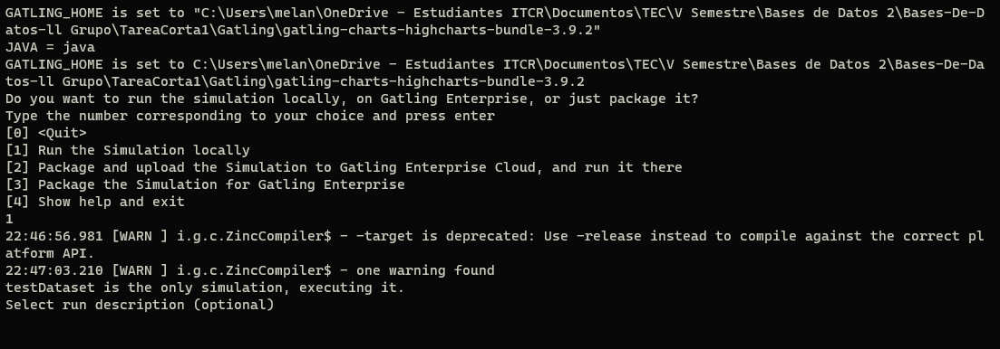

# Documentation

## **Instituto Tecnológico de Costa Rica**

## **IC4302 - Bases de Datos II**

## **Documentación Proyecto Opcional**

### **Profesor**: Nereo Campos Araya

### **Estudiantes**:

- Fiorella Zelaya Coto - 2021453615
- Isaac Araya Solano - 2018151703
- Melany Salas Fernández - 2021121147
- Moisés Solano Espinoza - 2021144322
- Pablo Arias Navarro - 2021024635

---

# **Guía de instalación y uso de la tarea**

1- Descomprimir el archivo .zip y abrir la linea de comandos wsl en la ubicación de la carpeta **tareaCorta1**

Posteriormente, puede ir a las carperpetas **charts\databases** donde encontrará el archivo **values.yaml**, aquí podrá escoger la base de datos a monitorear cambiando el valor de **enabled**

2- Ir a la carpeta **docker** con el comando **cd docker**

3- Ejecutar el comando **bash build.sh**, si da error al ejecutar, intente con el comando **dos2unix build.sh** y, posteriormente, ejecute de nuevo **bash build.sh**

4- Ir a la carpeta **charts** con el comando **cd ../charts**

5- Ejecutar el comando **bash install.sh**, si da error al ejecutar, intente con el comando **dos2unix install.sh** y, posteriormente, ejecute de nuevo **bash install.sh**, ya con esto, debería ver los distintos pods en lens

 

6- Una vez instalado y cuando los pods estan arriba, abrir la carpeta **Gatling** e ir a **gatling-charts-highcharts-bundle-3.9.2/bin** y ejecutar **galing.bat**

7- Esperar que abra la consola.

8- Una vez abierta, seleccionar la opción **[1]** presionando las teclas 1, seguido de enter.

9- Aparecerá lo siguiente, debe presionar la tecla enter nuevamente pata que la prueba de carga comience.

10- Puede entrar a la dirección que sale en consola para verificar la cantidad de usuarios que lograron conectarse con éxito.

11- Posteriormente, puede observar las métricas en **Grafana**, entrando a…

15- Para desinstalar, ejecute el comando **bash uninstall.sh**

# **Configuración de las herramientas**

## MariaDB

## PostGreSQL

## ElasticSearch

## MongoDB

# **Pruebas de carga realizadas**

Se realizo una prueba de carga con…

# **Conclusiones**

1- Es importante la comunicación entre el los miembros de grupo de trabajo.

2- Se debe mantener la organización para poder realizar la tarea.

3- Entender los conceptos vistos en clase ayuda en la realización de la tarea.

4- El tener un buen control de versiones y saber utilizar github facilita el trabajo en equipo.

5- Se deben aplicar buenas prácticas de programación para mantener el orden.

6- Mantener la estructura del proyecto es esencial

7- Se debe asegurar un código legible y entendible.

8- 

9-

10-

# **Recomendaciones**

1- Hacer reuniones periódicas para ver el avance de la tarea.

2- Mantener la organización de la tarea, según el ejemplo del profesor.

3- Repasar los conceptos vistos en clase y complementar con investigacion.

4- Aprender a hacer uso de github.

5- Seguir un estandar de código.

6- Seguir aprendiendo y enriqueciendo el conocimiento después de finalizar la tarea.

7- Investigar sobre herramientas esenciales para desarrollar la solución.

8- Tener una buena estructura del proyecto y dividir el proyecto de forma funcional.

9- Repartir y asignar tareas a cada integrante del equipo para progresar.

10-